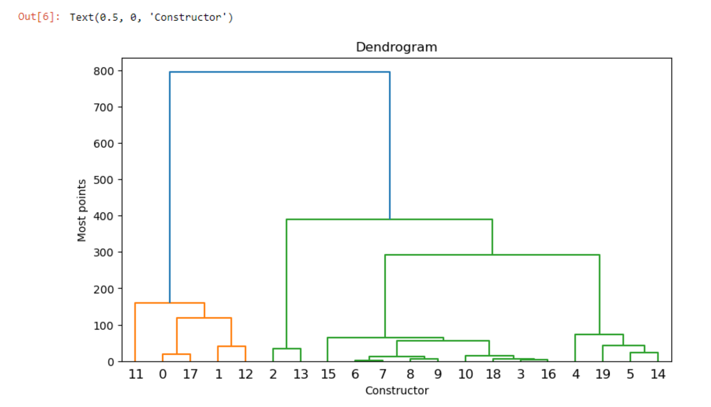

# TS1P
Within these files these is the supervised, unsupervides and new trends of the selected topics 1 class 
There ar in jupyter notebooks 
The csv file si the data that was used for all the files
## Project Description

This project was developed as part of the Selected Topics 1 class. It focuses on creating a supervised machine learning model to predict the F1 World Championship outcomes. The project explores various data preprocessing techniques, feature engineering, and model evaluation to achieve accurate predictions. The dataset used for this project was sourced from Kaggle, providing comprehensive historical data on F1 races, drivers, and teams.

## Tools Used

- **Python**: For data analysis and model development.
- **Jupyter Notebooks**: To document and execute the code interactively.
- **Pandas**: For data manipulation and cleaning.
- **Scikit-learn**: For implementing machine learning algorithms.
- **Matplotlib/Seaborn**: For data visualization.
- **CSV Files**: As the primary data source.
- **Kaggle**: For obtaining the dataset.

## How to Use Locally

1. Clone the repository:
    ```bash
    git clone https://github.com/alejandroollivierochoa/TS1P.git
    ```
2. Navigate to the project directory:
    ```bash
    cd TS1P
    ```
3. Install the required dependencies:
    ```bash
    pip install -r requirements.txt
    ```
4. Download the dataset from Kaggle:
    - Visit the Kaggle dataset page [here](https://www.kaggle.com/) (replace with the actual dataset link).
    - Download the dataset and place the `data.csv` file in the project directory.
5. Open the Jupyter Notebook files:
    ```bash
    jupyter notebook
    ```
6. Explore the notebooks to understand the workflow and run the code.

## Process Overview

1. **Data Loading**: The dataset is loaded from the CSV file into a Pandas DataFrame.
2. **Data Preprocessing**: Missing values are handled, and relevant features are selected for analysis.
3. **Exploratory Data Analysis (EDA)**: Visualizations are created to understand the data distribution and relationships.
4. **Feature Engineering**: New features are derived to improve model performance.
5. **Model Training**: Various machine learning models are trained and evaluated using Scikit-learn.
6. **Model Evaluation**: Metrics such as accuracy, precision, and recall are used to assess model performance.
7. **Prediction**: The final model is used to predict F1 World Championship outcomes.

## Results

Below is a visual representation of the constructors' positions based on the predictions made by the model:



This diagram provides insights into the predicted rankings of F1 constructors, showcasing the model's ability to analyze and predict outcomes effectively. Ensure the `constructors_positions.png` file is placed in the appropriate directory for the image to render correctly.

